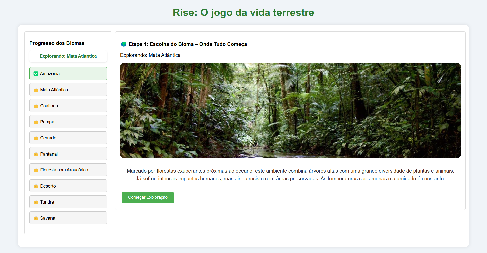

# Como Funciona o Jogo ODS 15: Vida Terrestre

## Visão Geral
O **Rise** é uma experiência gamificada que simula a restauração de biomas, inspirada no **Objetivo de Desenvolvimento Sustentável 15 (Vida Terrestre)**. O jogador explora **10 biomas**, tomando decisões para aumentar sua saúde ecológica, baseado em três métricas:  
- 🌿 **Índice Verde (`greenIndex`)**  
- 🦜 **Biodiversidade (`biodiversity`)**  
- 💡 **Consciência Ambiental (`awareness`)**  

---

## 📌 Estrutura Geral
| Componente          | Detalhes                                                                 |
|---------------------|--------------------------------------------------------------------------|
| **Biomas**          | 10 (Amazônia, Mata Atlântica, Caatinga, Pampa, Cerrado, Pantanal, Floresta com Araucárias, Deserto, Tundra, Savana) |
| **Objetivo**        | Escolher **4 animais** e **2 plantas**, responder um quiz e atingir **50+ pontos** (`greenIndex` + `biodiversity`) para avançar. |
| **Progresso**       | Salvo no `localStorage` com lista de biomas completados (`completedBiomes`). |

---

## 🎮 Etapas do Jogo

### 1. **Bioma Atual (`biome-selection`)**
- **O que acontece:**  
  - Exibe o bioma atual (ex: *"Explorando: Amazônia"*) com imagem e descrição.  
  - Botão **"Começar Exploração"** inicia o desafio.  
- **Métricas:** Nenhuma alteração.  

---

### 2. **Escolha de Animais (`animal-selection`)**
- **O que acontece:**  
  - Modal explica: *"Escolha 4 animais em harmonia com o bioma."*  
  - Grade com 10 animais (mínimo **3 nativos**).  
  - Confirmação com **"Confirmar Animais"**.  

#### 📊 Cálculo da **Biodiversidade (`biodiversity`)**:
| Tipo de Animal      | Pontos  | Exemplo (Amazônia)               |
|---------------------|---------|-----------------------------------|
| Nativo              | +10     | Onça-pintada, Arara-azul         |
| Compatível          | +5      | Lobo-guará (no Cerrado)          |
| Incompatível        | 0       | Urso-polar (na Amazônia)         |
| **Máximo**          | **40** (4 nativos × 10) | Penalidades por incompatibilidade entre animais podem reduzir até 10 pontos. |

---

### 3. **Escolha de Plantas (`plant-selection`)**
- **O que acontece:**  
  - Modal: *"Escolha 2 plantas para fortalecer o bioma."*  
  - Grade com 10 plantas (mínimo **3 nativas**).  

#### 📊 Cálculo do **Índice Verde (`greenIndex`)**:
| Tipo de Planta      | Pontos  | Exemplo (Amazônia)               |
|---------------------|---------|-----------------------------------|
| Nativa              | +20     | Castanheira-do-pará, Buriti      |
| Compatível          | +10     | Ipê-amarelo (no Cerrado)         |
| Incompatível        | 0       | Cacto mandacaru (na Amazônia)    |
| **Máximo**          | **40** (2 nativas × 20) | Bônus de +10 por sinergia com animais. |

---

### 4. **Análise do Bioma (`biome-status`)**
- **O que acontece:**  
  - Exibe:  
    ```plaintext
    Análise do seu bioma:
    Biodiversidade: 40
    Índice Verde: 30
    Total: 70
    ```  
  - Se `greenIndex + biodiversity ≥ 50` → **"Prosseguir para o Quiz"**.  
  - Senão → **Reiniciar bioma**.  

---

### 5. **Quiz Ambiental (`quiz-section`)**
- **O que acontece:**  
  - 3 perguntas sobre o bioma (ex: *"Por que a Amazônia é vital?"*).  
  - Cada acerto adiciona **~13.33 pontos** à `awareness`.  

#### 📊 Cálculo da **Consciência Ambiental (`awareness`)**:
| Desempenho no Quiz  | Pontos  |
|---------------------|---------|
| 3 respostas corretas| 40      |
| 1 resposta correta  | 13.33   |

---

### 6. **Resultado Final (`final-result`)**
- **O que acontece:**  
  - Resume:  
    ```plaintext
    Biodiversidade: 40/50  
    Índice Verde: 30/50  
    Consciência Ambiental: 40/40  
    Total: 110/140  
    ```  
  - Se `greenIndex + biodiversity ≥ 50` → bioma concluído!  
  - Opções: **"Explorar Próximo Bioma"** ou **"Reiniciar"**.  

---

## 🌍 Progresso Geral
- **Bioma no Topo:** `<p id="current-biome-display">` mostra *"Explorando: [Bioma]"* em todas as etapas.  
- **Biomas Completados:** Lista atualizada em `<ul id="biome-status-list">`.  
- **Fim do Jogo:** Após 10 biomas → *"Parabéns! Você completou todos os biomas!"* → Reseta progresso.  

---

## 📝 Exemplo Completo (Amazônia)
1. **Etapa 1:**  
   - Vê *"Explorando: Amazônia"* e clica em **"Começar Exploração"**.  
2. **Etapa 2:**  
   - Escolhe **Onça-pintada, Arara-azul, Bicho-preguiça, Tamanduá** → `biodiversity = 40`.  
3. **Etapa 3:**  
   - Escolhe **Castanheira-do-pará, Buriti** → `greenIndex = 40`.  
4. **Etapa 4:**  
   - Total = **80** → Avança para o quiz.  
5. **Etapa 5:**  
   - Acerta 3 perguntas → `awareness = 40`.  
6. **Etapa 6:**  
   - Total = **120** → Conclui Amazônia e desbloqueia próximo bioma.  

---

- Tela do jogo
  
  

  